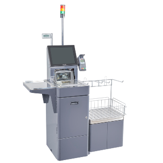

# Projecto de Auto-atendimento de uma Mercearia.

Tecnologias utilizadas no desafio:

    
  
    
    
     
    
    
    
    

## Definição do Problema proposto

Uma mercearia do Bairro Bom Descanso chamado JuMarket necessita de uma solução para venda de auto-atendimento, para tanto necessitamos desenvolver as seguintes funcionalidades.

**Cadastro de Categorias:** Um cadastro de categoria de produtos, apenas contendo o nome da categoria, por exemplo: Produtos de Limpeza, Bebidas, Bombonier, Salgadinhos, Chás e Cafés, Grãos e Cereais e outros.

**Cadastro de Produtos:** Um cadastro contendo os produtos do mercado, este cadastro poderá conter os seguites campos: Nome do Produto, Unidade de Medida, Preço Unitário

**Carrinho:** O carrinho é a funcionalidade na qual o usuário selecionou os produtos que deseja adquirir, neste caso conter os seguintes dados: produto, quantidade de intens e o preço da venda

**Finalização da Venda:** Ao finalizar a venda deverá ser informado o valor total e a forma de pagamento escolhida. As opções são: Cartão de crédito/débito, dinheiro e pix

**- Tabela categoria:** Guarda todas as categorias cadastradas.

**- Tabela unidade:** Guarda todas as unidades de medida cadastradas.

**- Tabela produto:** Guarda todos os produtos cadastrados.

**- Tabela carrinho:** É uma lista de produtos.

**- Tabela venda:** Guarda o valor total da venda e a forma de pagamento.

**- Tabela venda_carrinho:** Ao finalizar a venda, esta tabela guarda o relacionamento de quais itens foram comprados em cada compra quais eram seus valores unitários no ato da venda. Exemplo: A compra de id=1 possui os produtos 2, 6, 7, 8 e 9.
